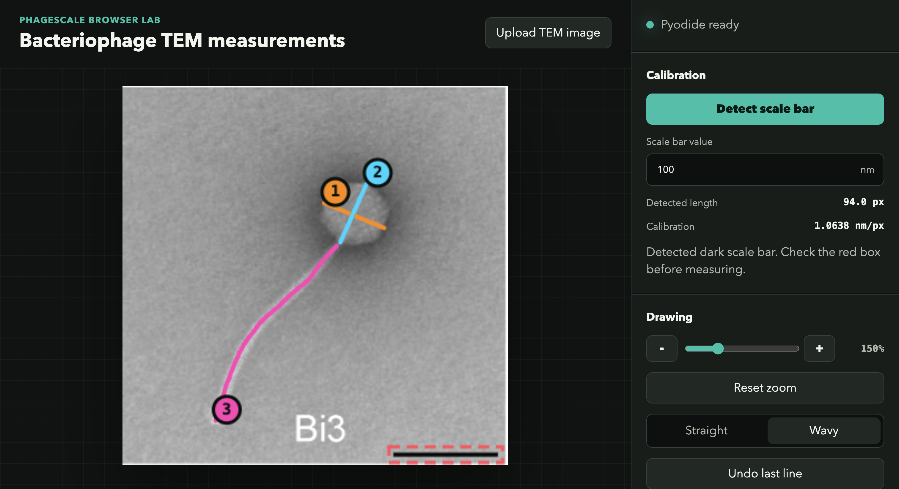
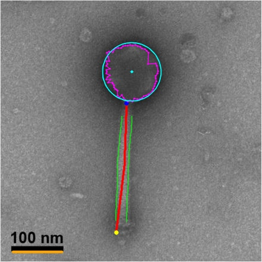
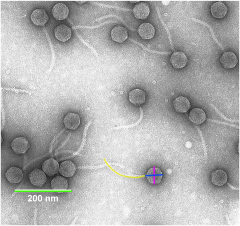
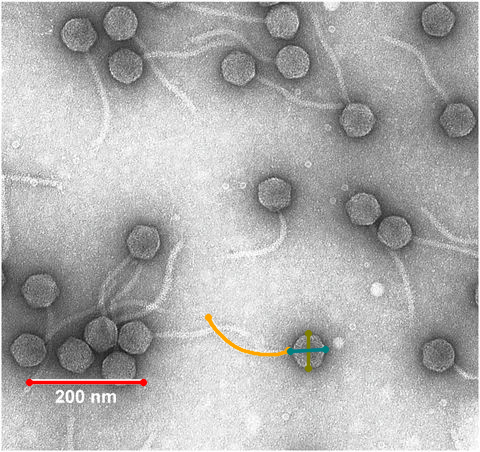

# PhageScale: measuring phage dimensions from transmission electron microscopy (TEM) images

PhageScale measures phage dimensions, specifically, capsid diameter and tail length, from transmission electron microscopy (TEM) images obtained from [PhageBase](https://www.phagebase.com/).

## Web App

We have provided a simple web app for you to upload your phage TEM image which will detect the scale bar. Then all you have to do is, draw the lines you want and the app will measure them based on the scale bar dimensions.

**🌐 Web app**:
[vini2.github.io/phagescale/](https://vini2.github.io/phagescale/)



## Install the CLI locally

First, clone this repository.

```bash
git clone https://github.com/Vini2/phagescale.git
```

Then, move to the `phagescale` directory.

```bash
cd phagescale
```

Now, install the following dependencies. Make sure you have `python` and `pip` installed.

```bash
pip install click opencv-python numpy scikit-image matplotlib
```

## Run

You can display the help message using `python phagescale.py --help`.

```bash
Usage: phagescale.py [OPTIONS] COMMAND [ARGS]...

  Measure phage capsid diameter and tail length from TEM images.

Options:
  -v, --version  Show the version and exit.
  -h, --help     Show this message and exit.

Commands:
  measure          Measure from raw TEM images.
  annotated        Measure one annotated figure using the same...
  annotated-batch  Measure all batch-annotated images using the final...
```

PhageScale has three subcommands:

- `measure` for raw TEM images, using automatic head and tail detection.
- `annotated` for figures where the capsid is marked in magenta, the tail is marked in yellow, and the scale bar may be marked in green.
- `annotated-batch` for running the final colored-line batch workflow across a metadata workbook and exporting a new Excel sheet.

Global options:

- `-v` or `--version` shows the CLI version
- `-h` or `--help` shows help

The image-level subcommands (`measure` and `annotated`) support:

- `--image` to input path of the image
- `--scale_nm` to input scale-bar length in nm
- `--overlay_out` for an output overlay image path
- `--show_overlay` to display the overlay
- printing the measured capsid diameter and tail length to `stdout`

The `annotated-batch` subcommand supports:

- `--images_dir` to directory containing annotated images
- `--metadata_xlsx` path to the metadata workbook (.xlsx)
- `--output_xlsx` path to the output workbook (.xlsx).  [required]
- `--sheet_name` to worksheet name to read. Defaults to the first sheet
- `--image_col` column containing the annotated image filename
- `--scale_col` column containing the scale bar size in nm
- `--usable_col` optional column used to decide which rows should be measured
- `--usable_require_blank` to skip rows such as `N` while still allowing supported partial rows
- `--overlay_dir` optional directory to save overlay images for successful measurements
- `--fail_fast` to stop on the first error instead of recording failures in the output workbook

## Commands explained

### 1. `measure` - Measuring from raw images

You can display the help message using `python phagescale.py measure --help`.

```bash
Usage: phagescale.py measure [OPTIONS]

  Measure from raw TEM images.

Options:
  --image FILE               Path to input image (png/jpg/tif).  [required]
  --scale_nm FLOAT           Scale bar value in nm.  [default: 100.0]
  --bar_px_override INTEGER  Manual scale bar length in pixels.
  --debug                    Enable verbose debug output.
  --overlay_out FILE         Path to save image with tail overlay.
  --show_overlay             Display the tail overlay at the end of the run.
  -h, --help                 Show this message and exit.
```

This command uses various computer vision techniques, including morphological operations and contour analysis for scale bar detection, Hough circle transform with contrast scoring for capsid identification, and direction-guided centerline tracing using multi-scale filtering (difference-of-Gaussians and morphological operations) for tail measurement.

Example command:

```bash
python phagescale.py measure --image /path/to/image.png --scale_nm 100 --debug
```

- `--scale_nm` is the numeric value printed for the scale bar, for example `100` for `100 nm`.
- If auto scale-bar detection fails, pass `--bar_px_override` with a manually measured bar length in pixels.
- `--overlay_out /path/to/output.png` saves an annotated image with the traced tail.
- `--show_overlay` displays the annotated image at the end of the run, and also saves it in the current working directory if `--overlay_out` is not provided.

Example command with overlay:

```bash
python phagescale.py measure --image /path/to/image.png --scale_nm 100 --overlay_out /path/to/annotated.png --show_overlay
```

**MarsHill example**

Input image:


Measure it with:

```bash
python phagescale.py measure --image images/measure/MarsHill.jpeg --scale_nm 100
```

Overlay output:



Save or display the overlay with:

```bash
python phagescale.py measure --image images/measure/MarsHill.jpeg --scale_nm 100 --overlay_out images/measure/MarsHill_overlay.jpeg --show_overlay
```


### 2. `annotated` - Measuring from annotated figures

You can display the help message using `python phagescale.py annotated --help`.

```bash
Usage: phagescale.py annotated [OPTIONS]

  Measure one annotated figure using the same colored-line workflow as
  annotated-batch.

Options:
  --image FILE        Path to input image (png/jpg/tif).  [required]
  --scale_nm FLOAT    Scale bar value in nm.  [default: 100.0]
  --overlay_out FILE  Path to save image with tail overlay.
  --show_overlay      Display the tail overlay at the end of the run.
  -h, --help          Show this message and exit.
```
**NOTE**: `annotated` uses the same colored guide-line workflow as `annotated-batch`:
- **green** = scale bar
- **yellow** = tail length
- **pink** = capsid width
- **blue** = capsid length

Example command:

```bash
python phagescale.py annotated --image /path/to/image.png --scale_nm 100
```

This keeps `annotated` as a one-image-at-a-time command while using the same measuring method as `annotated-batch`.

You can also save or display an overlay:

```bash
python phagescale.py annotated --image /path/to/image.png --scale_nm 100 --overlay_out /path/to/annotated_overlay.png --show_overlay
```

**Artemius example**

Input image:



Measure it with:

```bash
python phagescale.py annotated --image images/annotated/Midgardsormr38.png --scale_nm 100
```

Overlay output:



Save or display the overlay with:

```bash
python phagescale.py annotated --image images/annotated/Midgardsormr38.png --scale_nm 200 --overlay_out images/annotated/Midgardsormr38_overlay.png --show_overlay
```


### 3. `annotated-batch` - Batch measuring from an Excel metadata sheet

You can display the help message using `python phagescale.py annotated-batch --help`.

```bash
Usage: phagescale.py annotated-batch [OPTIONS]

  Measure all batch-annotated images using the final colored-line workflow.

Options:
  --images_dir DIRECTORY   Directory containing annotated images.  [required]
  --metadata_xlsx FILE     Path to the metadata workbook (.xlsx).  [required]
  --output_xlsx FILE       Path to the output workbook (.xlsx).  [required]
  --sheet_name TEXT        Worksheet name to read. Defaults to the first sheet.
  --image_col TEXT         Column containing the annotated image filename.
                           [default: File name]
  --scale_col TEXT         Column containing the scale bar size in nm.
                           [default: Scale bar measurement (nm)]
  --usable_col TEXT        Optional column used to decide which rows should
                           be measured.
  --usable_require_blank   Only measure rows where usable_col is blank; mark
                           other rows as skipped.
  --overlay_dir DIRECTORY  Optional directory to save overlay images for
                           successful measurements.
  --fail_fast              Stop on the first error instead of recording
                           failures in the output workbook.
  -h, --help               Show this message and exit.
```

Use this command when you have a workbook of final colored annotations where:

- green = scale bar
- yellow = tail length
- pink = capsid width
- blue = capsid length

```bash
python phagescale.py annotated-batch \
  --images_dir /path/to/annotated-images \
  --metadata_xlsx /path/to/input-metadata.xlsx \
  --output_xlsx /path/to/output-measurements.xlsx
```

By default, the input workbook is read from the first worksheet and expects these columns:

- `File name`
- `Scale bar measurement (nm)`

You can override those defaults with:

- `--sheet_name` to choose a specific worksheet
- `--image_col` to point at a different filename column
- `--scale_col` to point at a different scale column
- `--usable_col` and `--usable_require_blank` to skip rows such as `N` while still allowing special partial-measurement rows like `Only annotated capsid`

The output workbook preserves the original columns and appends these measurement fields:

- `Measurement status`
- `Measurement error`
- `Scale bar length (px)`
- `Scale bar length (nm)`
- `Tail length (px)`
- `Tail length (nm)`
- `Capsid width (px)`
- `Capsid width (nm)`
- `Capsid length (px)`
- `Capsid length (nm)`
- `Image path`
- `Metadata row`

Optional overlay export:

```bash
python phagescale.py annotated-batch \
  --images_dir /path/to/annotated-images \
  --metadata_xlsx /path/to/input-metadata.xlsx \
  --output_xlsx /path/to/output-measurements.xlsx \
  --overlay_dir /path/to/overlay-output
```

If you want the run to stop immediately on the first bad row instead of writing per-row errors to the output workbook, add `--fail_fast`.


## More Examples

Check the [images](https://github.com/Vini2/phagescale/tree/main/images) folder for more examples showing the usage of `measure` and `annotated`.


## Warning

PhageScale is still under active development and heavy testing. Some results might be incorrect depending on the differences in contrast, background noise, staining effects, etc. Different methods may give different measurements depending on how the capsid and tail are detected from the images.

## Acknowledgements

Special thanks goes to [Renee Green](https://github.com/reneegreen816) for providing the annotated TEM images and [Aaryan Harshith](https://aaryanharshith.com/) for providing access to [PhageBase](https://www.phagebase.com/) images.
