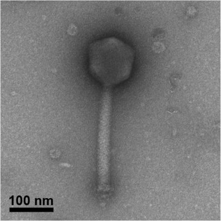
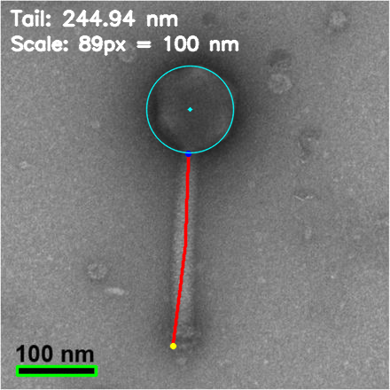
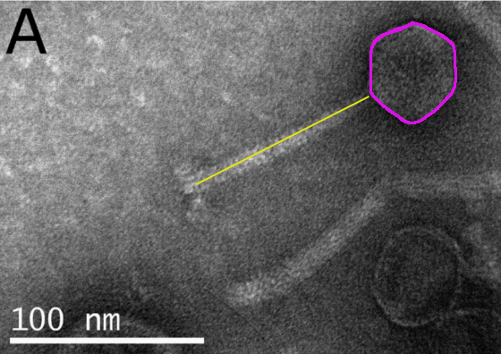
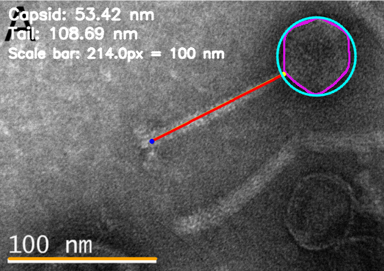

# PhageScale: measuring phage dimensions from TEM images

PhageScale measures phage dimensions from transmission electron microscopy (TEM) images obtained from [PhageBase](https://www.phagebase.com/).

## Install

First, clone this repository.

```bash
git clone https://github.com/Vini2/phagescale.git
```

Then, move to the `phagescale` directory.

```bash
cd phagescale
```

Now, install the following dependencies. Make sure you have `python` and `pip` installed.

```bash
pip install click opencv-python numpy scikit-image matplotlib
```

## Run

You can disply the help message using `python phagescale.py --help`.

```bash
Usage: phagescale.py [OPTIONS] COMMAND [ARGS]...

  Measure phage tail lengths from TEM images.

Options:
  -v, --version  Show the version and exit.
  -h, --help     Show this message and exit.

Commands:
  measure    Measure capsid size and tail lengths from raw TEM images.
  annotated  Measure tail lengths from yellow-annotated figures.
```

PhageScale has two subcommands:

- `measure` for raw TEM images, using automatic head and tail detection.
- `annotated` for figures where the tail has already been marked in yellow.

Global options:

- `-v` or `--version` shows the CLI version
- `-h` or `--help` shows help

Both subcommands support:

- `--image` to input path of the image
- `--scale_nm` to input scale-bar length in nm
- `--overlay_out` for an output overlay image path
- `--show_overlay` to display the overlay
- printing the measured tail length to `stdout`

### `measure` - Measuring from raw images

You can disply the help message using `python phagescale.py measure --help`.

```bash
Usage: phagescale.py measure [OPTIONS]

  Measure capsid size and tail lengths from raw TEM images.

Options:
  --image FILE               Path to input image (png/jpg/tif).  [required]
  --scale_nm FLOAT           Scale bar value in nm.  [default: 50.0]
  --bar_px_override INTEGER  Manual scale bar length in pixels.
  --debug                    Enable verbose debug output.
  --overlay_out FILE         Path to save image with tail overlay.
  --show_overlay             Display the tail overlay at the end of the run.
  -h, --help                 Show this message and exit.
```

Example command:

```bash
python phagescale.py measure --image /path/to/image.png --scale_nm 100 --debug
```

- `--scale_nm` is the numeric value printed for the scale bar, for example `100` for `100 nm`.
- If auto scale-bar detection fails, pass `--bar_px_override` with a manually measured bar length in pixels.
- `--overlay_out /path/to/output.png` saves an annotated image with the traced tail.
- `--show_overlay` displays the annotated image at the end of the run, and also saves it in the current working directory if `--overlay_out` is not provided.

Example command with overlay:

```bash
python phagescale.py measure --image /path/to/image.png --scale_nm 100 --overlay_out /path/to/annotated.png --show_overlay
```

**MarsHill example**

Input image:



Measure it with:

```bash
python phagescale.py measure --image images/measure/MarsHill.jpeg --scale_nm 100
```

Overlay output:



Save or display the overlay with:

```bash
python phagescale.py measure --image images/measure/MarsHill.jpeg --scale_nm 100 --overlay_out images/measure/MarsHill_overlay.png --show_overlay
```


### `annotated` -Measuring from annotated figures

You can disply the help message using `python phagescale.py annotated --help`.

```bash
Usage: phagescale.py annotated [OPTIONS]

  Measure tail lengths from yellow-annotated figures.

Options:
  --image FILE        Path to input image (png/jpg/tif).  [required]
  --scale_nm FLOAT    Scale bar value in nm.  [default: 100.0]
  --overlay_out FILE  Path to save image with tail overlay.
  --show_overlay      Display the tail overlay at the end of the run.
  -h, --help          Show this message and exit.
```
Make sure that your tail has already been marked in **yellow**.

Example command:

```bash
python phagescale.py annotated --image /path/to/figure.png --scale_nm 100
```

You can also save or display an overlay:

```bash
python phagescale.py annotated --image /path/to/figure.png --scale_nm 100 --overlay_out /path/to/annotated.png --show_overlay
```

**Artemius example**

Input image:



Measure it with:

```bash
python phagescale.py annotated --image images/annotated/Artemius_siphophage_R.png --scale_nm 100
```

Overlay output:



Save or display the overlay with:

```bash
python phagescale.py annotated --image images/annotated/Artemius_siphophage_R.png --scale_nm 100 --overlay_out images/annotated/Artemius_overlay.png --show_overlay
```

## More Examples

Check the [images](https://github.com/Vini2/phagescale/tree/main/images) folder for more examples showing the usage of `measure` and `annotated`.

## Regression Checks

Run the built-in regression suite for known calibration images:

```bash
python regression_tail_cases.py
```

Options:
- `--root /path/to/Phagebase_Images` to point to a different image directory.
- `--debug` to print per-image detection diagnostics.
- `--fail_on_missing` to fail when any regression image is missing.

## Warning

PhageScale is still under active development and heavy testing. Some results might be incorrect. 
